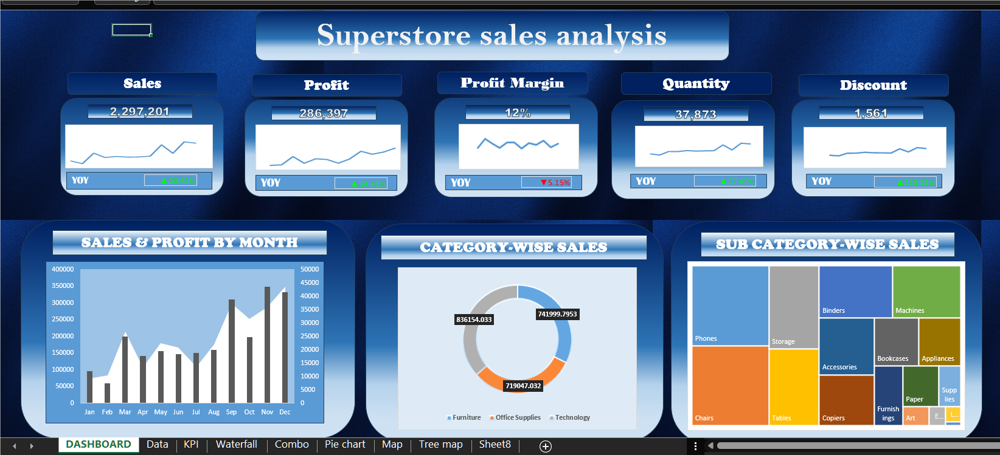
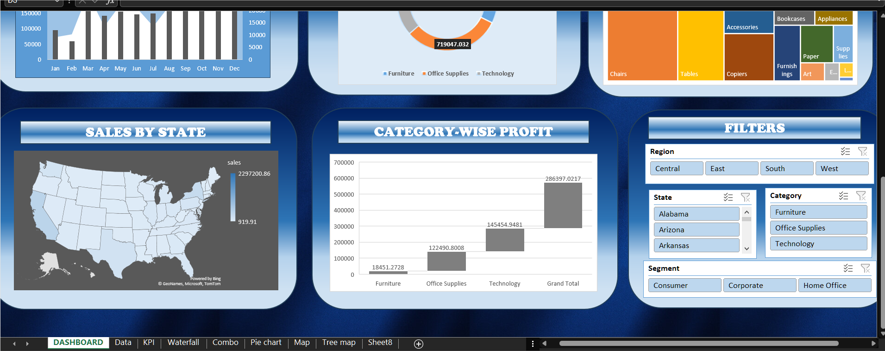

# Superstore Sales Dashboard (Excel)

This project is an interactive sales dashboard created in Microsoft Excel to analyze Superstore data and uncover business insights.
The goal of this project was to transform raw sales data into a clean, easy-to-understand dashboard that helps track performance, identify trends, and support decision-making.

##  What This Dashboard Shows
- Overall Sales, Profit, Quantity, and Discount KPIs  
- Sales and Profit trends over time  
- State-wise sales distribution  
- Category and Sub-category performance  
- Shipping mode analysis  
- Interactive filters for Region, Category, Segment, and Date
  

##  Tools & Techniques Used
- Microsoft Excel  
- Pivot Tables  
- Slicers
- KPI Cards  
- Data Visualization & Formatting
  

##  Key Takeaways
- Certain regions contribute significantly more to total sales.
- Technology category shows strong profitability compared to others.
- Shipping mode impacts profit margins.
- Seasonal patterns can be observed in monthly sales trends.

##  Dashboard Preview

### Top Section

### Bottom Section

---

This project demonstrates my ability to clean data, build interactive dashboards, and present insights in a structured and visually clear format.
